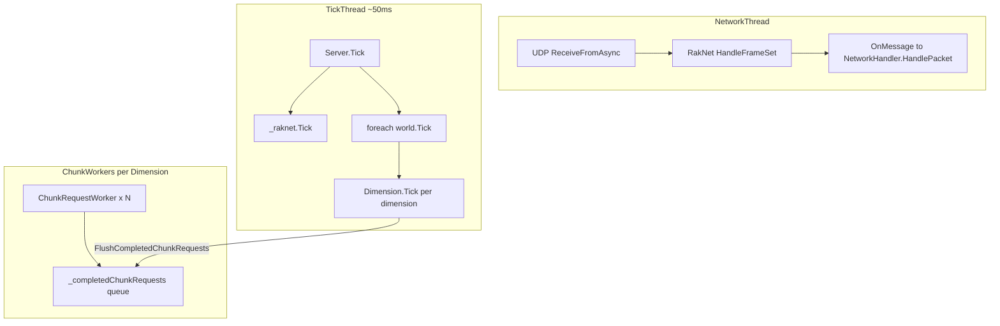
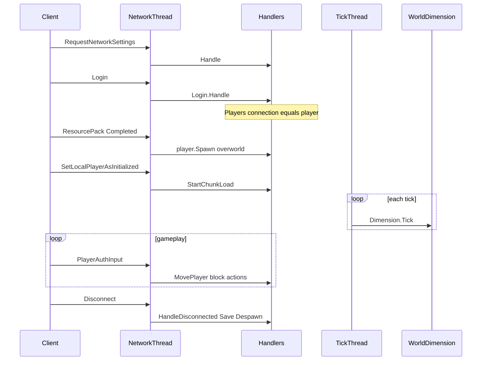

# 01 — Current State

This document has two parts:

1. **Implementation status** — what exists on branch `world-scheduler` through **Phase 4** (below).
2. **Baseline audit** — how Basalt worked **before** the scheduler (historical reference for regressions).

---

## Implementation status (Phases 0–4 complete)

| Area | Status | Notes |
|------|--------|-------|
| `WorldRegistration` + `world.json` loader | Done | Per-world `allowedWorkers`; no profiles |
| `PlayerSession` + `Server.Sessions` | Done | Phase 2 |
| `PacketIngress` | Done | Global inline; world-bound enqueued |
| `SingleThreadScheduler` | Done | Used when `world-scheduler-enabled=false` |
| `WorldWorkerPool` + `WorldScheduler` | Done | Phase 3; PickWorker by load among allowed workers |
| Attach / detach | Done | First player attach; last player detach |
| Active-only ticking | Done | Dormant worlds not ticked |
| Cross-worker transfer | Done | Phase 4; `/tp <world>` via snapshot protocol |
| `additional-worlds` boot | Done | Loads e.g. `world_copy` at startup |
| `/worldscheduler` debug command | **Not done** | Phase 5 |

### Config in use (smoke test)

```properties
world-thread-count=4
world-scheduler-enabled=true
world-scheduler-debug=true
```

Default world registration from `worlds/world/world.json`:

```json
{ "identifier": "world", "allowedWorkers": [0] }
```

### Observed debug log sequence (correct)

1. `[PacketIngress] inline packet=RequestNetworkSettings` / `Login` — global handlers
2. `[PacketIngress] enqueue worker=0 packet=ResourcePackClientResponse` — routed to default world worker
3. `[Attach] world=world worker=0` — attach before spawn processing
4. `[Worker:0] ProcessPacketMessage packet=...` — handler runs on worker thread
5. `[Detach] world=world worker=0` — last player disconnect

### Cross-world transfer smoke (`/tp world_copy`)

1. `[Transfer] PrepareTransfer from=world to=world_copy worker=0`
2. `[Detach] world=world worker=0`
3. `[Attach] world=world_copy worker=1` — PickWorker chooses freer thread among `[0,1]`
4. `[Transfer] CompleteTransfer session=... world=world_copy worker=1`
5. Gameplay packets on `[Worker:1]`

Automated tests: **29/29** passing (`dotnet test tests/Basalt.Tests`).

---

## Baseline audit (pre-scheduler)

The sections below describe Basalt **before** Phases 0–3. Keep them for understanding original pain points and integration hooks.

## Architecture summary (baseline)

Basalt runs **two primary loops** plus **per-dimension chunk workers**:



### Thread origins

| Thread | Created in | Purpose |
|--------|------------|---------|
| Network | `Server.Start()` → `Task.Run(_raknet.Start)` | UDP receive, RakNet, game packet dispatch |
| Tick | `Server.Start()` → `Task.Run` tick loop | `_raknet.Tick()`, all `World.Tick()` |
| Console | `Commands/ConsoleInterface.cs` | Admin commands via stdin |
| Chunk workers | `Dimension` constructor → `Task.Run(ChunkRequestWorker)` | Async chunk load/generate per dimension |

**There is no world scheduler.** Simulation is modeled as single-threaded but **network handlers execute on the network thread**.

---

## Component audit

| Area | File(s) | Current behavior |
|------|---------|------------------|
| Tick loop | `Basalt/Server.cs` ~L400–414 | Single thread; `foreach` all worlds every tick |
| Player registry | `Basalt/Server.cs` L62 | `Dictionary<NetworkConnection, Player>` |
| Network ingress | `Basalt/Network/Network.cs` | `HandlePacket` / `HandleDisconnected` on network thread |
| Network handlers | `Basalt/Network/Handlers/*.cs` (15 files) | Direct mutation of Player, Dimension, blocks |
| World model | `Basalt/World/World.cs` | `Tick()` increments `TickValue`, ticks all dimensions |
| Dimension tick | `Basalt/World/Dimension/Dimension.cs` L395–469 | Entity loop; iterates `server.Players` for simulation distance |
| Dimension broadcast | `Basalt/World/Dimension/Dimension.cs` L471+ | Iterates `server.Players` filtered by dimension |
| Chunk async | `Basalt/World/Dimension/Dimension.cs` L18, L711 | `ChunkWorkerLimit = Clamp(ProcessorCount - 1, 1, 4)` |
| World CRUD | `Basalt/Server.cs` CreateWorld / LoadWorld / UnloadWorld | No scheduler; worlds live in `_worlds` dictionary |
| Config | `Basalt/Properties.cs` | No threading / scheduler options |
| Events | `Basalt/Server.cs` On / Emit | Handlers run on caller thread; no affinity |
| Plugins | `Basalt/Plugins/PluginManager.cs` | `Assembly.LoadFrom`; full `Server` reference |
| Player model | `Basalt/Player/Player.cs` | Entity + session + identity in one class |
| Teleport | `Basalt/Player/Player.cs` `Teleport()` | Same-thread dimension/world change |
| Commands | `Basalt/Commands/CommandRegistry.cs` | Client + console; may mutate world from network/console thread |

---

## Player lifecycle (today)



---

## Single-thread assumptions violated today

The codebase **intends** one tick thread to own simulation, but these structures are accessed from **multiple threads without synchronization**:

| Structure | Readers | Writers |
|-----------|---------|---------|
| `Server.Players` | Tick (`Dimension.Tick`), Broadcast | Network (Login, Disconnect, handlers) |
| `Server._worlds` | Tick | CreateWorld, UnloadWorld (any thread) |
| `Server._signalHandlers` | Emit | On (typically startup) |
| `Dimension._chunks`, `_entities` | Tick | Network handlers, chunk workers (via flush) |
| `Entity._runtimeCounter` | Spawn | Any thread spawning entities |
| `World.TickValue` | Packet handlers | Tick thread |
| World providers (LevelDB) | Login save, workers, tick save | Multiple threads |

### Handlers that mutate world state on network thread

| Handler | File | Mutations |
|---------|------|-----------|
| `PlayerAuthInput` | `Network/Handlers/PlayerAuthInput.cs` | Position, blocks, sprint, item use |
| `InventoryTransaction` | `Network/Handlers/InventoryTransaction.cs` | Place/break blocks, drops, containers |
| `Interact` | `Network/Handlers/Interact.cs` | Entity interaction |
| `PlayerAction` | `Network/Handlers/PlayerAction.cs` | Player actions |
| `MobEquipment` | `Network/Handlers/MobEquipment.cs` | Equipment |
| `ItemStackRequest` | `Network/Handlers/ItemStackRequest.cs` | Inventory |
| `CommandRequest` | `Network/Handlers/CommandRequest.cs` | Commands including `/tp` |
| `Text` | `Network/Handlers/Text.cs` | Chat |
| `Login` | `Network/Handlers/Login.cs` | Player create, `Players.Add`, NBT load |
| `ResourcePackClientResponse` | `Network/Handlers/ResourcePackClientResponse.cs` | Spawn |
| `Network.HandleDisconnected` | `Network/Network.cs` | Despawn, save, `Players.Remove` |

**Phase 1 must fix this** before multi-worker simulation is safe.

---

## Existing async pattern to reuse

`Dimension` chunk loading already implements **worker produces, tick consumes**:

1. `RequestChunks` enqueues work for `ChunkRequestWorker`.
2. Workers call `_provider.LoadChunk` / `_generator.Generate`.
3. Results go to `_completedChunkRequests` (`ConcurrentQueue`).
4. `FlushCompletedChunkRequests` applies mutations during `Dimension.Tick`.

The World Scheduler should follow the same pattern for:

- Packet handling (network → worker queue → tick/process)
- Cross-worker transfers (source worker → scheduler → target worker)
- Save/load on detach

Reference: `Basalt/World/Dimension/Dimension.cs` — `ChunkRequestWorker`, `FlushCompletedChunkRequests`.

---

## Partial synchronization today

| Location | Mechanism |
|----------|-----------|
| `Dimension._chunkRequestLock` | Chunk request queue |
| `PlayerChunkRenderingTrait._lock` | Client chunk state |
| `PlayerAuthInput` | `ConcurrentDictionary` for input dedup only |
| `EntityPalette`, `BlockPalette`, `ItemPalette` | `LoadLock` |
| `NetworkConnection._sendLock` | RakNet outbound frames |

Do **not** add ad-hoc locks throughout simulation code. Prefer **message passing to the owning worker thread**.

---

## Integration points for World Scheduler

| Hook | File | Change |
|------|------|--------|
| Replace `foreach world.Tick()` | `Basalt/Server.cs` `Tick()` | Delegate to `WorldWorkerPool` or `SingleThreadScheduler` |
| Packet ingress | `Basalt/Network/Network.cs` | Route through `PacketIngress` |
| First player spawn / world enter | `ResourcePackClientResponse`, teleport | Call `scheduler.RequestAttach(world)` |
| Last player leave / disconnect | `Network.HandleDisconnected`, detach logic | Call `scheduler.RequestDetach(world)` |
| World creation | `Server.CreateWorld` | Attach `WorldRegistration` |
| Config | `Basalt/Properties.cs` | `world-thread-count`, feature flags |
| Broadcast by dimension | `Dimension.Broadcast` | Iterate sessions with entity in this dimension |

---

## What is NOT implemented (Phase 5)

- Scheduler metrics API and `/worldscheduler` debug command
- `Server.RunOnWorldThread` helper for plugins
- Removal of obsolete `Server.Players` adapter

Phases 0–4 items listed in older versions of this doc **are implemented** — see table above.

---

## Next steps

Read [02-core-concepts.md](./02-core-concepts.md) for invariants, then [08-phased-implementation.md](./08-phased-implementation.md) for Phase 4+.
