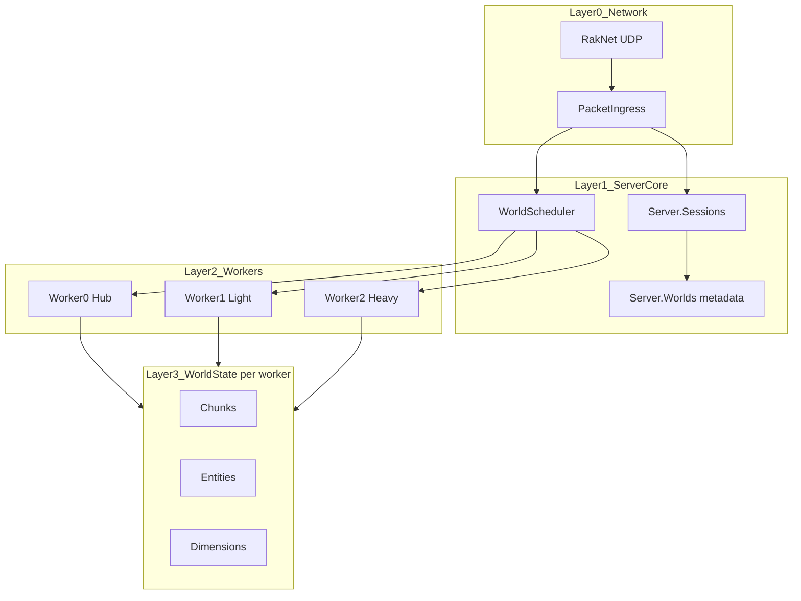
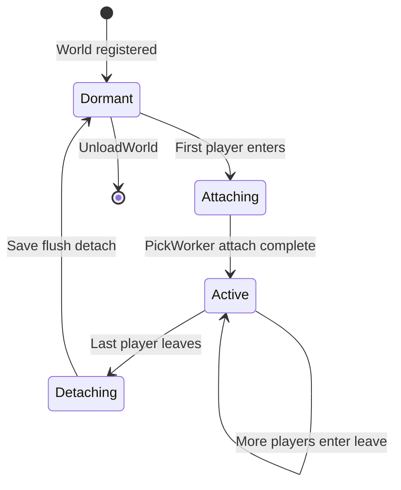
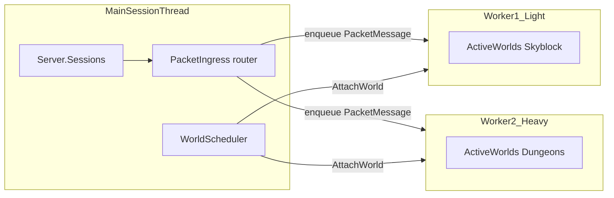

# 02 — Core Concepts

This document defines formal terms, invariants, and the target architecture. **Every implementation agent must follow these rules.**

## System layers



### Layer responsibilities

| Layer | Owns | Thread |
|-------|------|--------|
| Network | UDP, RakNet frames, decompression | Network thread |
| Server core | Sessions, scheduler decisions, world metadata | Main / session thread (or dedicated coordinator) |
| Worker | Active world simulation for attached worlds | One thread per worker |
| World state | Chunks, entities, block mutations | **Only** the owning worker thread |

---

## Core types

### PlayerSession (server-level)

Represents a **connected client**. Thread-safe. Lives in `Server.Sessions`.

- Identity: `Xuid`, `Uuid`, `Username`
- Connection: `NetworkConnection`, `NetworkHandler`
- Client metadata: `Skin`, `DeviceOS`
- Optional link: `ActiveEntity` (player entity on a worker, or null during transfer)
- Methods: `SendPacket`, `SendMessage`, `Disconnect`

**Never** holds position, inventory, or dimension references directly.

### Player (world entity)

Represents an **entity in a world**. Worker-local. Inherits `Entity`.

- `Position`, `Dimension`, traits, inventory, gamemode, operator status
- May exist **without** a session (NPCs, fake players)
- Mutated **only** on the worker that owns its world

### Player data scope: per-world

All **game state** is scoped to a world and persisted in that world's provider (`WorldProvider.SavePlayerData` / `LoadPlayerData` by XUID):

| Data | Storage | Notes |
|------|---------|-------|
| Inventory, equipment | Target world's LevelDB | Default on cross-world transfer |
| Gamemode, `isOp`, permissions | Target world's LevelDB | Not global across worlds |
| Saved position (`x`, `y`, `z`) | Target world's LevelDB | Used when entering a world without explicit coords |
| Connection, skin, identity | `PlayerSession` | Connection lifetime only |

**Login** loads player data from the **default spawn world** only. **Disconnect** saves to the **current** world. **Cross-world transfer** (`/tp <world>`) loads the target world's save by default; optional `--carry inventory` / `--carry position` merge from the source (see [07-cross-worker-transfer.md](./07-cross-worker-transfer.md)).

Implementation: [`PlayerWorldTransfer.cs`](../../../Basalt/Player/PlayerWorldTransfer.cs).

### World (metadata + lazy state)

Registered in `Server._worlds`. Holds:

- `WorldRegistration` (allowed workers)
- Provider, dimensions (when loaded)
- `AttachedWorkerId` (null if not active)
- `PresentPlayerCount` (maintained by session/scheduler)

### ActiveWorld

A world with **≥1 player present**, attached to exactly one worker, receiving tick updates.

### WorldWorker

A simulation thread that:

1. Drains its message queue
2. Ticks all attached active worlds
3. Reports load metrics to the scheduler

### WorldScheduler

Central coordinator that:

- Implements `PickWorker(registration)`
- Handles attach/detach requests
- Tracks which worlds are active on which workers
- Does **not** mutate chunk/entity state directly

---

## Invariants

These must **never** be broken. Code reviews and tests should enforce them.

```
INVARIANT 1: World state (chunks, entities, blocks, containers in world)
             is mutated ONLY on the owning worker thread.

INVARIANT 2: PlayerSession is thread-safe and lives at server level.
             Player entity lives on exactly one worker at a time.

INVARIANT 3: Worlds with zero players present are NOT attached to any worker
             and are NOT ticked.

INVARIANT 4: Worker assignment MUST respect WorldRegistration.AllowedWorkers.
             If PreferredWorker is set and allowed, use it; else PickWorker.

INVARIANT 5: World-bound events and plugin callbacks run on the owning worker thread.
             Global events (ServerStart, PlayerJoin before spawn) run on session/main thread.

INVARIANT 6: SendPacket to a client is thread-safe via connection outbound queue
             (RakNet _sendLock). Simulation code must not assume send == sync flush.

INVARIANT 7: A PlayerSession has at most one ActiveEntity at a time.

INVARIANT 8: Cross-worker transfer is atomic from the session perspective:
             Transferring state blocks new packets until CompleteTransfer or abort.
```

---

## Active world lifecycle



| State | Ticking | On worker |
|-------|---------|-------------|
| Dormant | No | No |
| Attaching | No (queued) | Pending |
| Active | Yes | Yes |
| Detaching | No (draining) | Yes until flush done |

---

## Player count rules

- Increment when a session's entity **spawns** into a world (not on login alone if spawn is deferred).
- Decrement when entity **despawns** or session disconnects.
- `RequestDetach(world)` when count transitions **1 → 0**.
- `RequestAttach(world)` when count transitions **0 → 1** (or on first spawn if world was dormant).

Edge case: player in transfer — count stays on **source** world until `PrepareTransfer` completes, then destination attach logic runs. See [07-cross-worker-transfer.md](./07-cross-worker-transfer.md).

---

## Thread affinity diagram



---

## Relationship to plugins

Plugins keep a **server-level** view:

```csharp
// Target API (Phase 2+)
foreach (PlayerSession session in server.Sessions.Online)
{
    Player? entity = session.ActiveEntity;
    if (entity?.Dimension?.World is World world) { /* ... */ }
}
```

Plugins must not cache `Player` entity references across ticks without verifying the entity is still the session's active entity.

Helper (Phase 5):

```csharp
server.RunOnWorldThread(world, () => { /* safe world mutation */ });
```

---

## Anti-patterns

| Do not | Do instead |
|--------|------------|
| Lock `Player` or `Dimension` from random threads | Post `IWorldMessage` to worker |
| Iterate all worlds every tick | Tick only attached active worlds |
| Store `Player` in static plugin fields | Store session id; resolve each tick |
| Assign world to worker outside `AllowedWorkers` | Fail attach or log error and reject |
| Tick dormant worlds "just in case" | Attach on first player only |

---

## Related documents

- World registration: [03-world-registration.md](./03-world-registration.md)
- Scheduler algorithm: [04-world-scheduler.md](./04-world-scheduler.md)
- Session split: [05-player-session-split.md](./05-player-session-split.md)
