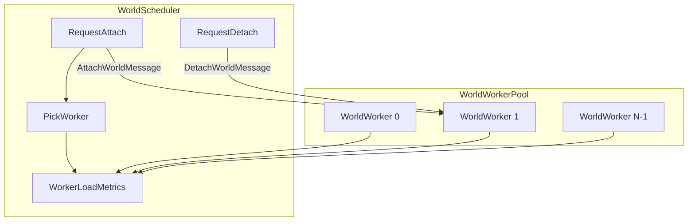
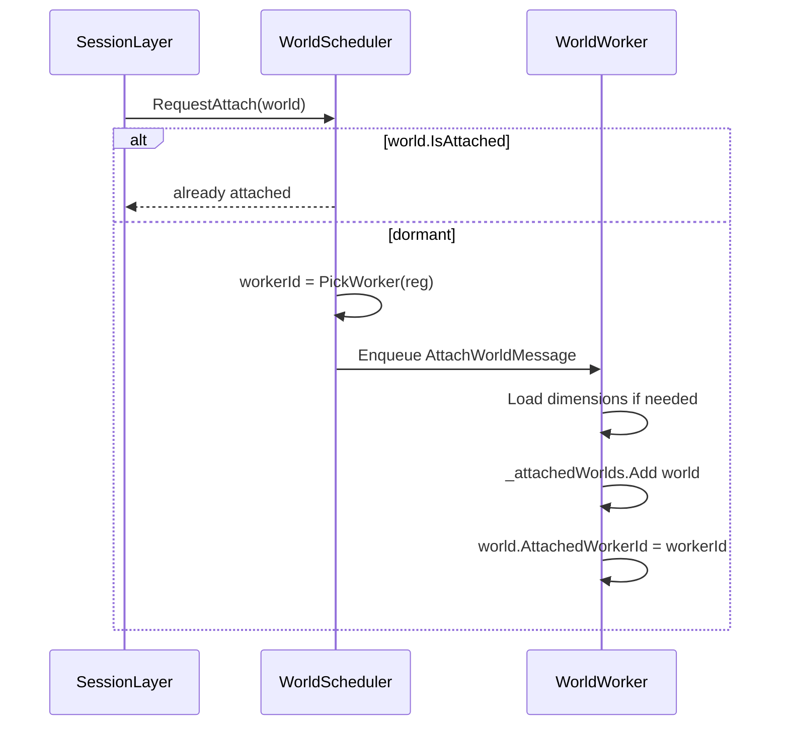
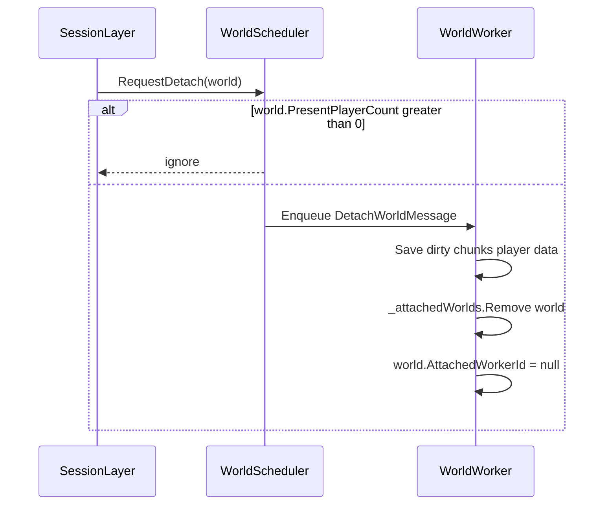

# 04 — World Scheduler

The **World Scheduler** attaches and detaches active worlds to workers, picks the least loaded allowed worker, and routes messages between network/session code and worker threads.

## Component overview



## Proposed file layout

```
Basalt/Scheduling/
├── IWorldScheduler.cs
├── WorldScheduler.cs
├── SingleThreadScheduler.cs      # Phase 0-1: noop / single queue
├── WorldWorkerPool.cs
├── WorldWorker.cs
├── WorldRegistration.cs
├── WorldRegistrationLoader.cs
├── WorkerLoadMetrics.cs
├── ActiveWorldHandle.cs
├── PacketIngress.cs
└── Messages/
    ├── IWorldMessage.cs
    ├── AttachWorldMessage.cs
    ├── DetachWorldMessage.cs
    ├── TickWorldsMessage.cs
    ├── ProcessPacketMessage.cs
    ├── PrepareTransferMessage.cs
    └── CompleteTransferMessage.cs
```

---

## IWorldScheduler

```csharp
public interface IWorldScheduler
{
    void Start();
    void Stop();

    /// <summary>First player entering a dormant world.</summary>
    void RequestAttach(World world);

    /// <summary>Last player left an active world.</summary>
    void RequestDetach(World world);

    /// <summary>Read-only metrics for debug / Phase 5.</summary>
    IReadOnlyList<WorkerLoadMetrics> GetMetrics();

    /// <summary>Enqueue packet handling to the correct worker.</summary>
    void EnqueuePacket(PlayerSession session, ReadOnlyMemory<byte> payload);
}
```

---

## WorldWorkerPool

Created at `Server.Start()` when `world-scheduler-enabled=true` (Phase 3+).

```csharp
public sealed class WorldWorkerPool : IDisposable
{
    private readonly WorldWorker[] _workers;

    public WorldWorkerPool(int workerCount, Server server)
    {
        _workers = new WorldWorker[workerCount];
        for (int i = 0; i < workerCount; i++)
            _workers[i] = new WorldWorker(i, server);
    }

    public WorldWorker GetWorker(int id) => _workers[id];
    public int WorkerCount => _workers.Length;

    public void Start() { /* start all worker threads */ }
    public void Stop() { /* drain queues, join threads */ }
}
```

Each `WorldWorker`:

- Runs a loop: `while (running) { DrainQueue(); TickAttachedWorlds(); ReportMetrics(); }`
- Owns `Dictionary<string, World> _attachedWorlds`
- Owns `ConcurrentQueue<IWorldMessage> _inbox`

---

## PickWorker algorithm

```csharp
public int PickWorker(WorldRegistration reg)
{
    if (reg.PreferredWorker is int preferred)
        return preferred;

    int bestWorker = -1;
    double bestScore = double.MaxValue;

    foreach (int workerId in reg.AllowedWorkers)
    {
        WorkerLoadMetrics m = _pool.GetWorker(workerId).Metrics;
        double score = ComputeScore(m);
        if (score < bestScore)
        {
            bestScore = score;
            bestWorker = workerId;
        }
    }

    if (bestWorker < 0)
        throw new InvalidOperationException($"No eligible worker for world {reg.Identifier}.");

    return bestWorker;
}

private static double ComputeScore(WorkerLoadMetrics m)
{
    return m.ActiveWorldCount
         + m.TotalPresentPlayers * 0.5
         + m.LastTickWorkMs
         + m.TickLagMs * 2.0;
}
```

### Tie-breaking

If two workers have equal score within epsilon (`0.01`):

1. Prefer worker with **fewer** `ActiveWorldCount`.
2. If still tied, prefer the worker listed **first** in `allowedWorkers` (stable default).

### Constraints

- Only consider workers in `reg.AllowedWorkers`.
- Never assign outside allowed set, even under overload.
- If all allowed workers are above soft threshold, still pick lowest score (no reject unless `MaxConcurrentPlayers` on world exceeded).

---

## Attach flow



### AttachWorldMessage handler (on worker)

1. Verify world not already in `_attachedWorlds`.
2. Ensure provider/dimensions ready (lazy load OK).
3. Set `world.AttachedWorkerId = WorkerId`.
4. Log `[Attach] world={id} worker={WorkerId}`.

**Trigger points** (implement in Phase 3):

- First spawn into world after login (`ResourcePackClientResponse`)
- Teleport / transfer completing into dormant world
- Plugin API `EnsureWorldActive(world)`

---

## Detach flow



### DetachWorldMessage handler (on worker)

1. Assert `PresentPlayerCount == 0`.
2. Save world state via provider.
3. Unload simulated chunks (keep world in `Server._worlds` metadata).
4. Clear `AttachedWorkerId`.
5. Log `[Detach] world={id} worker={WorkerId}`.

**Trigger points**:

- Last player disconnect while in this world
- Last player teleports out (after transfer completes on destination)
- Admin unload after evacuating players

---

## Worker tick loop

```csharp
private void WorkerLoop(CancellationToken token)
{
    while (!token.IsCancellationRequested)
    {
        long tickStart = Stopwatch.GetTimestamp();
        DrainInbox(maxMessages: 256);

        foreach (World world in _attachedWorlds.Values)
            world.Tick();

        Metrics.LastTickWorkMs = ElapsedMs(tickStart);
        Metrics.Tps = ComputeLocalTps();
        SleepUntilNextTickDeadline(tickStart);
    }
}
```

- Target: **20 TPS per worker** (same 50 ms budget as today), independent TPS per worker in metrics.
- `DrainInbox` processes packets and attach/detach before tick (deterministic ordering).

Message priority within one drain pass:

1. `DetachWorldMessage`
2. `PrepareTransferMessage` / `CompleteTransferMessage`
3. `AttachWorldMessage`
4. `ProcessPacketMessage`
5. (internal) tick already runs after drain

---

## WorkerLoadMetrics

```csharp
public sealed class WorkerLoadMetrics
{
    public int WorkerId { get; init; }
    public int ActiveWorldCount { get; set; }
    public int TotalPresentPlayers { get; set; }
    public double LastTickWorkMs { get; set; }
    public double TickLagMs { get; set; }
    public double Tps { get; set; }
}
```

Updated at end of each worker tick. Scheduler reads metrics **without locking** using volatile / Interlocked fields (approximate values OK for load balancing).

---

## SingleThreadScheduler (Phase 0–1)

Until multi-worker is enabled:

- One internal queue consumed by existing `Server.Tick()` thread.
- `PickWorker` always returns `0`.
- Attach/detach still update `PresentPlayerCount` and skip tick for dormant worlds.
- Validates marshaling before adding real worker threads.

---

## PacketIngress integration

See [06-packet-routing.md](./06-packet-routing.md). Summary:

- `PacketIngress` resolves `PlayerSession` from connection.
- If session has `ActiveEntity`, enqueue `ProcessPacketMessage` to `entity.World.AttachedWorkerId`.
- Global handlers (Login) run on session thread without enqueue.

---

## Shutdown order

1. Stop accepting new connections.
2. Disconnect all sessions.
3. `WorldWorkerPool.Stop()` — send `ShutdownMessage` to each worker, drain detach.
4. Cancel tick thread / join workers.
5. `Plugins.DisableAll()`.

---

## Related documents

- Registration: [03-world-registration.md](./03-world-registration.md)
- Packet routing: [06-packet-routing.md](./06-packet-routing.md)
- Cross-worker transfer: [07-cross-worker-transfer.md](./07-cross-worker-transfer.md)
- Phases: [08-phased-implementation.md](./08-phased-implementation.md)
