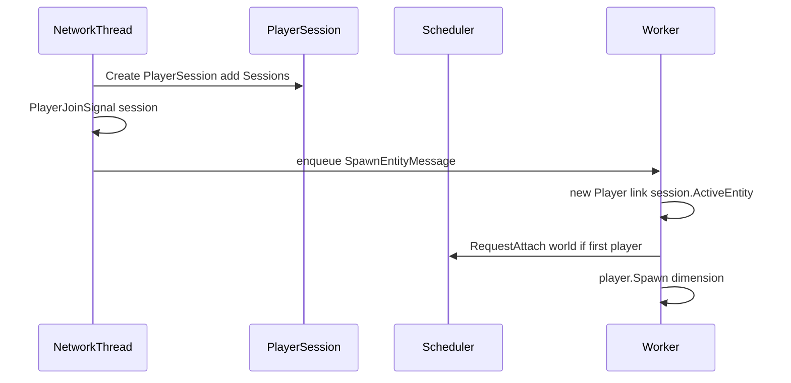

# 05 — Player Session Split

Split **PlayerSession** (connection + identity, server-level) from **Player** (world entity, worker-local). Required before Phase 3 multi-worker simulation.

## Current problem

`Basalt/Player/Player.cs` combines three roles:

| Role | Examples | Lifetime |
|------|----------|----------|
| Identity / persistence | `Username`, `Xuid`, `Uuid`, `Gamemode`, NBT | Survives disconnect |
| Session / network | `Connection`, `Network`, `Skin`, `Send()` | Connection lifetime |
| World entity | `Position`, `Dimension`, traits, inventory | Bound to one world at a time |

Cross-worker transfer requires the **session** to stay stable while the **entity** is despawned and recreated on another worker.

---

## Target types

### PlayerSession

File: `Basalt/Player/PlayerSession.cs`

```csharp
public sealed class PlayerSession
{
    public required NetworkConnection Connection { get; init; }
    public required NetworkHandler Network { get; init; }

    public required string Username { get; init; }
    public required string Xuid { get; init; }
    public required Guid Uuid { get; init; }

    public DeviceOS DeviceOS { get; set; }
    public Skin Skin { get; set; }

    /// <summary>Entity on a worker; null during login or cross-worker transfer.</summary>
    public Player? ActiveEntity { get; set; }

    public TransferState TransferState { get; set; } = TransferState.Idle;

    public void Send(DataPacket packet) { /* Connection + Network */ }
    public void SendMessage(string message) { /* Text packet */ }
    public void Disconnect(string reason) { /* ... */ }
}

public enum TransferState
{
    Idle,
    Transferring
}
```

Thread-safety: `ActiveEntity` and `TransferState` updates use `Interlocked` or a small lock on the session object. Worker threads must not mutate session fields except via defined transfer APIs.

### Player (entity only)

File: `Basalt/Player/Player.cs` (refactored)

```csharp
public sealed class Player : Entity
{
    /// <summary>Null for NPCs / fake players.</summary>
    public PlayerSession? Session { get; internal set; }

    // Remove: Connection, Network, Skin, DeviceOS as primary fields
    // Keep: world state, traits, gamemode (or move gamemode to session — see note below)

    public bool IsOnline => Session is not null;
}
```

**Gamemode / permissions**: **per-world** on the entity (NBT in each world's LevelDB). The session does **not** duplicate op status or permissions.

- `IsOperator`, `Permissions`, `Gamemode` → **Entity** (loaded/saved per world)
- `PlayerSession` → connection and identity only

### Server registry

```csharp
// Basalt/Server.cs
public ConcurrentDictionary<NetworkConnection, PlayerSession> Sessions { get; } = new();

// Phase 2 compatibility shim (remove in Phase 4):
[Obsolete("Use Sessions and session.ActiveEntity")]
public IReadOnlyDictionary<NetworkConnection, Player> Players => _legacyPlayersAdapter;
```

---

## NPC / fake players

```csharp
var npc = new Player("Guard", xuid: "", uuid: Guid.NewGuid());
npc.Session = null;
npc.Spawn(dimension, options);
```

No session, no network packets. Exists only on worker.

---

## Refactor map by file

### Network handlers (replace `server.Players.TryGetValue` → session)

| File | Changes |
|------|---------|
| `Network/Handlers/Login.cs` | Create `PlayerSession`; defer entity create to spawn handler |
| `Network/Handlers/RequestNetworkSettings.cs` | No entity needed |
| `Network/Handlers/ResourcePackClientResponse.cs` | Create `Player` entity, link `session.ActiveEntity`, attach world |
| `Network/Handlers/SetLocalPlayerAsInitialized.cs` | Use session.ActiveEntity |
| `Network/Handlers/PlayerAuthInput.cs` | Resolve session → enqueue to worker |
| `Network/Handlers/InventoryTransaction.cs` | Same |
| `Network/Handlers/Interact.cs` | Same |
| `Network/Handlers/PlayerAction.cs` | Same |
| `Network/Handlers/MobEquipment.cs` | Same |
| `Network/Handlers/ItemStackRequest.cs` | Same |
| `Network/Handlers/ContainerClose.cs` | Same |
| `Network/Handlers/RequestChunkRadius.cs` | Same |
| `Network/Handlers/CommandRequest.cs` | Same |
| `Network/Handlers/Text.cs` | Same |
| `Network/Handlers/ClientCacheStatus.cs` | Same |
| `Network/Network.cs` | Disconnect: save entity NBT, clear ActiveEntity, remove session |

### World / dimension

| File | Changes |
|------|---------|
| `World/Dimension/Dimension.cs` | Simulation distance: iterate sessions where `ActiveEntity.Dimension == this` |
| `World/Dimension/Dimension.cs` | Broadcast: same filter |
| `Entity/ItemEntity.cs` | Pickup: iterate nearby sessions/entities on worker |

### Commands

| File | Changes |
|------|---------|
| `Commands/Enums/TargetEnum.cs` | Resolve `@a` via sessions with ActiveEntity |
| `Commands/List/Operator/List.cs` | Count sessions |
| `Commands/List/Operator/Teleport.cs` | Teleport entity; trigger attach/detach |
| `Commands/CommandExecutionState.cs` | `PlayerExecutor` holds session or entity reference |

### Player class

| File | Changes |
|------|---------|
| `Player/Player.cs` | Remove connection fields; delegate Send to Session |
| `Player/Player.cs` | `SetGamemode` sync packets via Session |

### Events

| File | Changes |
|------|---------|
| `Events/Player/PlayerSignal.cs` | Consider `PlayerSession` + optional entity |
| All emit sites | Pass entity; plugins resolve session via `entity.Session` |

---

## Login flow (after split)



---

## Plugin API

```csharp
public abstract class Plugin
{
    protected IEnumerable<PlayerSession> GetOnlineSessions()
        => Server.Sessions.Values;

    protected IEnumerable<Player> GetOnlineEntities()
        => Server.Sessions.Values
            .Select(s => s.ActiveEntity)
            .Where(p => p is not null)!;
}
```

Document: plugins should prefer **session** for identity and **entity** for world actions.

---

## Migration strategy (Phase 2)

1. Add `PlayerSession` and `Server.Sessions` without removing `Players`.
2. Adapter: `Players` dictionary built from sessions for backward compat.
3. Migrate handlers one-by-one to sessions.
4. Remove duplicate fields from `Player`.
5. Delete adapter when all internal code migrated.

---

## Related documents

- Packet routing: [06-packet-routing.md](./06-packet-routing.md)
- Cross-worker transfer: [07-cross-worker-transfer.md](./07-cross-worker-transfer.md)
- Phase 2 checklist: [08-phased-implementation.md](./08-phased-implementation.md)
