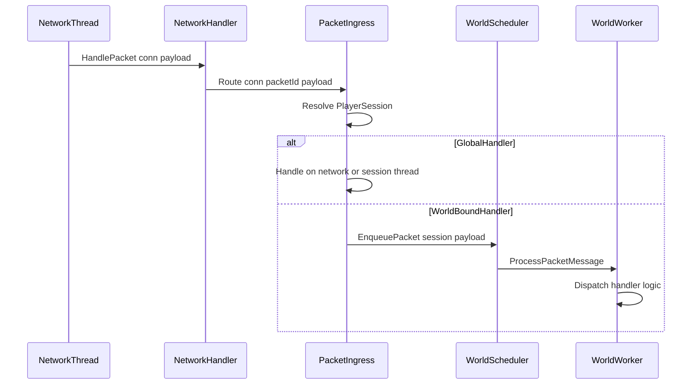

# 06 — Packet Routing

Network packets must not mutate world state on the network thread. **PacketIngress** receives packets, resolves the session, and enqueues work to the correct worker (or handles global packets inline).

## Pipeline overview



## PacketIngress

File: `Basalt/Scheduling/PacketIngress.cs`

```csharp
public sealed class PacketIngress
{
    private readonly Server _server;
    private readonly IWorldScheduler _scheduler;

    public void Route(NetworkConnection connection, PacketId id, ReadOnlyMemory<byte> payload)
    {
        if (IsGlobalHandler(id))
        {
            HandleGlobal(connection, id, payload);
            return;
        }

        if (!_server.Sessions.TryGetValue(connection, out PlayerSession? session))
            return;

        if (session.TransferState == TransferState.Transferring)
            return; // drop or buffer — see 07-cross-worker-transfer

        if (session.ActiveEntity is null)
            return;

        _scheduler.EnqueuePacket(session, payload);
    }
}
```

---

## Handler classification

### Global handlers (run without worker enqueue)

Processed on **network thread** or **dedicated session queue** (Phase 1: same as tick thread via SingleThreadScheduler).

| Handler | File | Reason |
|---------|------|--------|
| Login | `Handlers/Login.cs` | No entity yet |
| RequestNetworkSettings | `Handlers/RequestNetworkSettings.cs` | Pre-login |

### Pre-entity world-bound (enqueued to default world worker)

| Handler | File | Reason |
|---------|------|--------|
| ResourcePackClientResponse | `Handlers/ResourcePackClientResponse.cs` | Session exists but entity not spawned yet; routed to default world worker, triggers attach before spawn |

### World-bound handlers (must run on owning worker)

| Handler | File |
|---------|------|
| PlayerAuthInput | `Handlers/PlayerAuthInput.cs` |
| InventoryTransaction | `Handlers/InventoryTransaction.cs` |
| ItemStackRequest | `Handlers/ItemStackRequest.cs` |
| Interact | `Handlers/Interact.cs` |
| PlayerAction | `Handlers/PlayerAction.cs` |
| MobEquipment | `Handlers/MobEquipment.cs` |
| ContainerClose | `Handlers/ContainerClose.cs` |
| RequestChunkRadius | `Handlers/RequestChunkRadius.cs` |
| SetLocalPlayerAsInitialized | `Handlers/SetLocalPlayerAsInitialized.cs` |
| ClientCacheStatus | `Handlers/ClientCacheStatus.cs` |
| CommandRequest | `Handlers/CommandRequest.cs` |
| Text | `Handlers/Text.cs` |

---

## ProcessPacketMessage

```csharp
public sealed class ProcessPacketMessage : IWorldMessage
{
    public required PlayerSession Session { get; init; }
    public required ReadOnlyMemory<byte> Payload { get; init; }
}

// On worker:
void Handle(ProcessPacketMessage msg)
{
    Player entity = msg.Session.ActiveEntity
        ?? throw new InvalidOperationException("Packet for session without entity.");

    NetworkHandler.HandleGamePacketOnWorker(_server, msg.Session, entity, msg.Payload);
}
```

Refactor `NetworkHandler.HandleGamePacket` to accept `PlayerSession` + `Player entity` and assert `Thread.CurrentThread == workerThread` in debug builds.

---

## Phase 1: Single-thread marshaling

Before multi-worker:

```csharp
public void EnqueuePacket(PlayerSession session, ReadOnlyMemory<byte> payload)
{
    _mainThreadQueue.Enqueue(new ProcessPacketMessage { Session = session, Payload = payload });
}

// Server.Tick():
_singleThreadScheduler.DrainMainQueue();
```

All world-bound packets processed on tick thread — **fixes races** without multiple workers.

Feature flag: `world-scheduler-enabled=false` keeps legacy direct handler path until Phase 1 tests pass.

---

## Phase 3: Multi-worker dispatch

```csharp
public void EnqueuePacket(PlayerSession session, ReadOnlyMemory<byte> payload)
{
    Player entity = session.ActiveEntity ?? return;
    World world = entity.Dimension!.World!;
    int workerId = world.AttachedWorkerId
        ?? throw new InvalidOperationException($"World {world.Name} not attached.");

    _pool.GetWorker(workerId).Enqueue(new ProcessPacketMessage { Session = session, Payload = payload });
}
```

---

## Outbound packets (SendPacket)

RakNet already serializes sends with `_sendLock` in `NetworkConnection`. Workers may call `session.Send(packet)` safely.

**Do not** read entity state from network thread after enqueue returns — use values captured in the message if needed for responses.

---

## Console commands

`Commands/ConsoleInterface.cs` runs on console thread. All world-mutating commands must:

```csharp
_scheduler.RunOnWorldThread(targetWorld, () => command.Execute(state));
```

Or enqueue equivalent message. `/tp`, `/give`, `/summon` are world-bound.

---

## Batch packets

`NetworkHandler.HandlePacket` supports batched payloads. Either:

- Split batch on network thread and enqueue each sub-packet, or
- Enqueue entire batch as one message and split on worker

Prefer **split on ingress** to preserve per-packet ordering with other messages.

---

## Ordering guarantees

Per session, packets must be processed **FIFO** on the owning worker. Use one queue per worker (not per session) but preserve order by single consumer thread per worker.

If multiple sessions share a worker, their messages interleave — acceptable for different players.

---

## Error handling

- Handler exception on worker: log, disconnect session if corrupt state suspected.
- Do not propagate exception to network thread.
- Use `try/catch` per message in `DrainInbox`.

---

## Debug

When `world-scheduler-debug=true`:

```
[PacketIngress] inline packet=Login
[PacketIngress] enqueue worker=0 packet=PlayerAuthInput
[Attach] world=world worker=0
[Worker:0] ProcessPacketMessage packet=PlayerAuthInput durationMs=0.08
[Detach] world=world worker=0
```

---

## Related documents

- Scheduler: [04-world-scheduler.md](./04-world-scheduler.md)
- Session split: [05-player-session-split.md](./05-player-session-split.md)
- Transfer blocking: [07-cross-worker-transfer.md](./07-cross-worker-transfer.md)
- Tests: [09-testing.md](./09-testing.md) Phase 1
