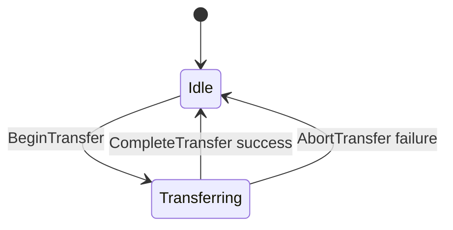
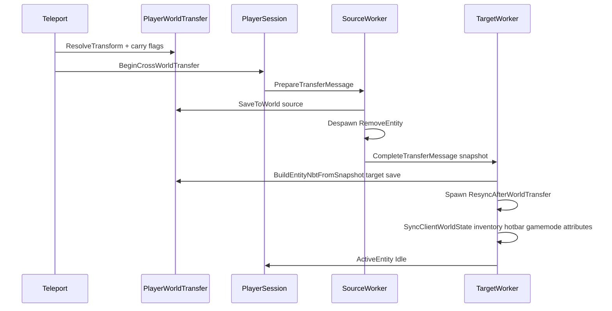

# 07 — Cross-Worker Transfer

Moving a player between worlds requires coordinated steps across session layer, scheduler, and one or two workers. **Game state is per-world**; the session carries only connection data.

> **Default cross-world behavior:** the player enters the target world with that world's LevelDB save (inventory, gamemode, op, saved position). Nothing from the source world is merged unless the `/tp` command passes explicit `--carry` flags.

---

## When transfer crosses workers

| Scenario | Same worker | Cross-worker |
|----------|-------------|--------------|
| Teleport within same world | Yes | No |
| Teleport to dimension in same world | Yes | No |
| Teleport to different world, same worker | Yes (via `PlayerWorldTransfer`) | No |
| Teleport island (worker 1) → dungeon (worker 3) | No | **Yes** |
| Disconnect | Detach if last player | N/A |

- **Cross-worker:** snapshot protocol below (`PrepareTransfer` / `CompleteTransfer`).
- **Same-worker cross-world:** [`PlayerWorldTransfer.ApplySameWorker`](../../../Basalt/Player/PlayerWorldTransfer.cs) (save source, load target NBT, resync). No snapshot messages.

---

## Per-world state and carry flags

| Layer | Contents |
|-------|----------|
| `PlayerSession` | Connection, identity, skin, `ActiveEntity`, `TransferState` |
| Target world LevelDB | Base entity NBT on arrival (default) |
| `--carry inventory` | Merge inventory + equipment from source snapshot |
| `--carry position` | Use source position/rotation instead of target save |

Position resolution for `/tp <world>` (no explicit coordinates):

1. `--carry position` → current source position
2. Else → saved `x`/`y`/`z` from target world's LevelDB
3. Else → default spawn `(0, -57, 0)`

Explicit coordinates (`/tp x y z`) always override saved position.

---

## Transfer state machine



While `TransferState.Transferring`:

- Drop or buffer inbound world-bound packets (see [06-packet-routing.md](./06-packet-routing.md)).
- Reject duplicate transfer requests.

---

## Entity snapshot (cross-worker only)

Partial serializable state — **not** a full entity clone:

```csharp
public sealed class PlayerEntitySnapshot
{
    public required string Username { get; init; }
    public required string Xuid { get; init; }
    public required Guid Uuid { get; init; }
    public required Vec3f Position { get; init; }  // resolved destination
    public float Pitch { get; init; }
    public float Yaw { get; init; }
    public float HeadYaw { get; init; }
    public TransferCarryFlags CarryFlags { get; init; }
    public required CompoundTag SourceEntityNbt { get; init; }  // merge source only
    // + transfer metadata: RuntimeId, SourceWorldId, TargetWorldId, ...
}
```

On **PrepareTransfer**, the source worker:

1. `SavePlayerData` on the **source** world (full current state).
2. Captures `SourceEntityNbt` for optional carry merge.
3. Despawns and enqueues `CompleteTransferMessage`.

On **CompleteTransfer**, the target worker:

1. `BuildEntityNbtFromSnapshot` → load target save, apply carry flags.
2. `FromNBT`, spawn, `ResyncAfterWorldTransfer` → `SyncClientWorldState` (inventário, hotbar, gamemode, atributos).

---

## Protocol steps



---

## Integration with Teleport command

File: [`Basalt/Commands/List/Operator/Teleport.cs`](../../../Basalt/Commands/List/Operator/Teleport.cs)

```
/tp world_copy
/tp world_copy --carry inventory
/tp world_copy --carry position
/tp world_copy --carry inventory,position
/tp 100 64 200 --carry inventory
```

Cross-world branch:

```csharp
if (PlayerWorldTransfer.IsCrossWorld(sourceWorld, targetWorld))
{
    if (NeedsCrossWorkerTransfer(...))
        scheduler.BeginCrossWorldTransfer(session, targetWorld, dimension, transform, carryFlags);
    else
        PlayerWorldTransfer.ApplySameWorker(server, player, targetWorld, dimension, transform, carryFlags);
}
```

---

## Target world dormant

If target world has no players:

1. `RequestAttach(targetWorld)` runs PickWorker.
2. Worker loads world state lazily.
3. `CompleteTransfer` spawns player from target save (+ carry merge).

First player entering an island **always** triggers attach — consistent with Skyblock model.

---

## Failure / abort

If `CompleteTransfer` fails (world load error):

1. Log error.
2. `session.TransferState = Idle`.
3. Disconnect with message.
4. Never leave session with null entity and Idle state without recovery.

---

## Player count during transfer

| Event | Source world count | Target world count |
|-------|-------------------|-------------------|
| PrepareTransfer despawn | -1 | unchanged |
| CompleteTransfer spawn | unchanged | +1 |

---

## Related code

- [`PlayerWorldTransfer.cs`](../../../Basalt/Player/PlayerWorldTransfer.cs) — save/load, resolve position, build NBT, same-worker path
- [`CrossWorldTransferHandler.cs`](../../../Basalt/Scheduling/CrossWorldTransferHandler.cs) — cross-worker prepare/complete
- [`Teleport.cs`](../../../Basalt/Commands/List/Operator/Teleport.cs) — `--carry` parsing

---

## Related documents

- Scheduler attach/detach: [04-world-scheduler.md](./04-world-scheduler.md)
- Session split: [05-player-session-split.md](./05-player-session-split.md)
- Tests: [09-testing.md](./09-testing.md) Phase 4
