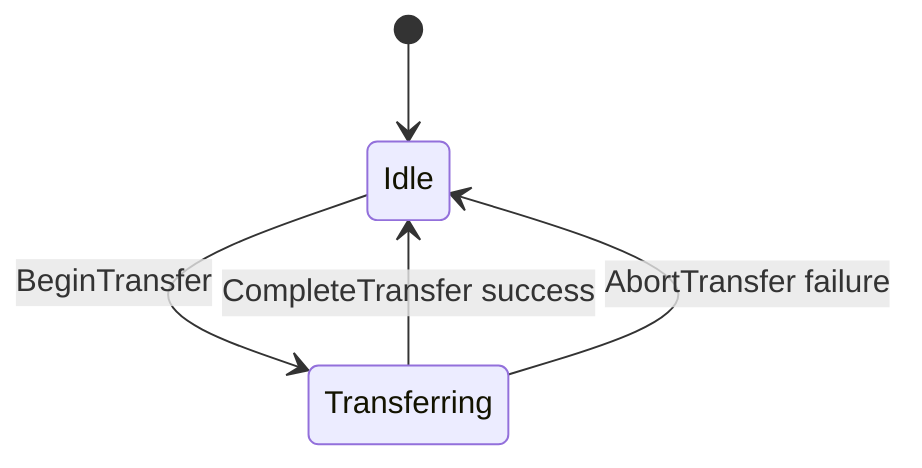
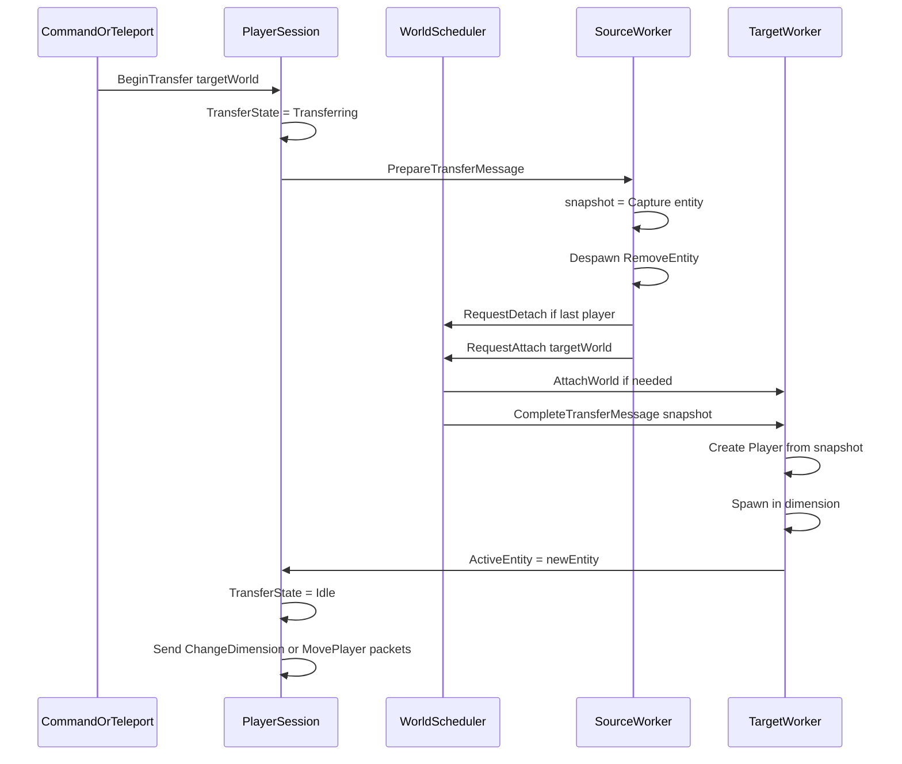

# 07 — Cross-Worker Transfer

Moving a player between worlds (or dimensions on different workers) requires a coordinated protocol across session layer, scheduler, and two workers.

## When transfer crosses workers

| Scenario | Same worker | Cross-worker |
|----------|-------------|--------------|
| Teleport within same world | Yes | No |
| Teleport to dimension in same world | Yes | No |
| Teleport to different world, same worker | Yes | No |
| Teleport island (worker 1) → dungeon (worker 3) | No | **Yes** |
| Disconnect | Detach if last player | N/A |

Same-worker path: existing `Player.Teleport` logic on worker thread (Phase 4 minor cleanup).

Cross-worker path: protocol below.

---

## Transfer state machine



While `TransferState.Transferring`:

- Drop or buffer inbound world-bound packets (see [06-packet-routing.md](./06-packet-routing.md)).
- Reject duplicate transfer requests.

---

## Entity snapshot

Minimal serializable state to recreate entity on target worker:

```csharp
public sealed class PlayerEntitySnapshot
{
    public required string Username { get; init; }
    public required Guid Uuid { get; init; }
    public required Vec3f Position { get; init; }
    public required string TargetWorldId { get; init; }
    public required string TargetDimensionId { get; init; }
    public float Pitch { get; init; }
    public float Yaw { get; init; }
    public Gamemode Gamemode { get; init; }
    public CompoundTag EntityNbt { get; init; }  // inventory, attributes, etc.
}
```

Built on source worker from `Player.WriteToNbt()` plus transfer metadata.

---

## Protocol steps



### Step 1 — BeginTransfer (session / command thread)

```csharp
public void BeginCrossWorldTransfer(PlayerSession session, World targetWorld, Vec3f position, Dimension? dimension)
{
    if (session.TransferState != TransferState.Idle)
        throw new InvalidOperationException("Transfer already in progress.");

    session.TransferState = TransferState.Transferring;
    var request = new PrepareTransferMessage(session, targetWorld, position, dimension);
    _scheduler.EnqueueToWorker(session.ActiveEntity!.Dimension!.World!.AttachedWorkerId!.Value, request);
}
```

### Step 2 — PrepareTransfer (source worker)

1. Capture `PlayerEntitySnapshot`.
2. Decrement `PresentPlayerCount` on source world.
3. `Despawn` entity, remove from dimension.
4. Set `session.ActiveEntity = null` (via thread-safe session update).
5. If `PresentPlayerCount == 0`, `RequestDetach(sourceWorld)`.
6. `RequestAttach(targetWorld)` — scheduler runs PickWorker.
7. Enqueue `CompleteTransferMessage` on **target** worker with snapshot.

### Step 3 — CompleteTransfer (target worker)

1. Ensure world attached on this worker.
2. Increment `PresentPlayerCount` on target world.
3. Create `Player` from snapshot; set `player.Session = session`.
4. `player.FromNBT(snapshot.EntityNbt)`.
5. `Spawn(targetDimension, options)`.
6. Set `session.ActiveEntity = player`.
7. Set `session.TransferState = Idle`.
8. Send client packets (`ChangeDimensionPacket` if dimension type changes, else `MovePlayerPacket`).

---

## Integration with Teleport command

File: `Basalt/Commands/List/Operator/Teleport.cs`

```csharp
if (sourceWorld.AttachedWorkerId != targetWorld.AttachedWorkerId
    || !targetWorld.IsAttached)
{
    session.BeginCrossWorldTransfer(targetWorld, position, dimension);
    return CommandResult.Success();
}

// Same worker: existing player.Teleport(position, dimension)
```

---

## Target world dormant

If target world has no players:

1. `RequestAttach(targetWorld)` runs PickWorker.
2. Worker loads world state lazily.
3. `CompleteTransfer` spawns player.

First player entering an island **always** triggers attach — consistent with Skyblock model.

---

## Failure / abort

If `CompleteTransfer` fails (world load error):

1. Log error.
2. `session.TransferState = Idle`.
3. Teleport player to server default world spawn (emergency) or disconnect with message.
4. Never leave session with null entity and Idle state without recovery.

---

## Same-worker optimization

Skip snapshot protocol when:

```csharp
sourceWorld.AttachedWorkerId == targetWorld.AttachedWorkerId
&& targetWorld.IsAttached
```

Call `player.Teleport(position, dimension)` directly on worker.

---

## Player count during transfer

| Event | Source world count | Target world count |
|-------|-------------------|-------------------|
| PrepareTransfer despawn | -1 | unchanged |
| CompleteTransfer spawn | unchanged | +1 |

Avoid double decrement if multiple players transfer simultaneously — each transfer only affects its own entity.

---

## Related code (current)

- `Basalt/Player/Player.cs` — `Teleport()` lines ~329–391
- `Basalt/Commands/List/Operator/Teleport.cs` — `TeleportPlayers`, dimension resolution

---

## Related documents

- Scheduler attach/detach: [04-world-scheduler.md](./04-world-scheduler.md)
- Session split: [05-player-session-split.md](./05-player-session-split.md)
- Tests: [09-testing.md](./09-testing.md) Phase 4
