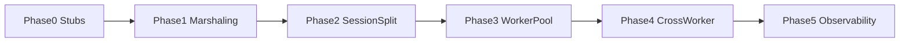

# 08 — Phased Implementation

Incremental delivery plan. **Do not skip phases.** Each phase has explicit deliverables, files, and acceptance criteria.

Feature flag: `world-scheduler-enabled` (default `false` until Phase 3 stable).

---

## Phase 0 — Contracts and stubs

**Goal:** Introduce types and interfaces without changing runtime behavior.

### Deliverables

- [ ] Create `Basalt/Scheduling/` folder with stub types
- [ ] `WorldRegistration`, `WorldRegistrationLoader`, `IWorldScheduler`
- [ ] `SingleThreadScheduler` — all methods noop or pass-through
- [ ] Add optional `World.Registration` property (defaults for existing worlds)
- [ ] Document-only validation helpers

### Files to create

| File | Purpose |
|------|---------|
| `Basalt/Scheduling/WorldRegistration.cs` | Registration model + Validate |
| `Basalt/Scheduling/WorldRegistrationLoader.cs` | Load per-world JSON |
| `Basalt/Scheduling/IWorldScheduler.cs` | Interface |
| `Basalt/Scheduling/SingleThreadScheduler.cs` | Noop implementation |
| `Basalt/Scheduling/WorldRegistrationDefaults.cs` | Fallback from server.properties |

### Files to modify

| File | Change |
|------|--------|
| `Basalt/World/World.cs` | Add `Registration`, `AttachedWorkerId`, `PresentPlayerCount`, `IsAttached` |
| `Basalt/Server.cs` | Hold `IWorldScheduler _scheduler`; default `SingleThreadScheduler` |

### Do NOT

- Change network handler behavior
- Add worker threads
- Break existing `Server.Players` API

### Acceptance criteria

- `dotnet build` succeeds
- Server starts and behaves identically to before
- All new types have XML doc comments

### Suggested PR

`feat(scheduling): add WorldRegistration and scheduler stubs (Phase 0)`

---

## Phase 1 — Single-thread marshaling + active-only ticking

**Goal:** Fix thread safety on one tick thread; only tick worlds with players present.

**Prerequisite for all multi-worker work.**

### Deliverables

- [ ] `PacketIngress` routes world-bound packets to main thread queue
- [ ] `SingleThreadScheduler.DrainMainQueue()` called from `Server.Tick()`
- [ ] `PresentPlayerCount` maintained on spawn/despawn/disconnect
- [ ] `Server.Tick()` skips worlds with `PresentPlayerCount == 0`
- [ ] Refactor handlers to `HandleGamePacketOnWorker` (still one thread)

### Files to create

| File | Purpose |
|------|---------|
| `Basalt/Scheduling/PacketIngress.cs` | Route global vs world-bound |
| `Basalt/Scheduling/Messages/IWorldMessage.cs` | Message interface |
| `Basalt/Scheduling/Messages/ProcessPacketMessage.cs` | Packet queue item |

### Files to modify

| File | Change |
|------|--------|
| `Basalt/Network/Network.cs` | Delegate to PacketIngress |
| `Basalt/Network/Handlers/*.cs` | World-bound logic callable from worker/main thread |
| `Basalt/Server.cs` | Drain queue before world tick; filter dormant worlds |
| `Basalt/Network/Handlers/ResourcePackClientResponse.cs` | Increment PresentPlayerCount on spawn |
| `Basalt/Network/Network.cs` | Decrement on disconnect |

### Do NOT

- Spawn multiple worker threads yet
- Split PlayerSession yet (optional overlap with Phase 2)

### Acceptance criteria

- No world state mutation from network thread (verify with debug assert)
- Empty worlds do not increment `TickValue`
- Manual: 2 players break/place blocks — no corruption
- Manual: login/logout 10× — no crash
- Automated tests from [09-testing.md](./09-testing.md) Phase 1

### Suggested PRs

1. `feat(scheduling): PacketIngress and main-thread queue (Phase 1a)`
2. `feat(scheduling): active-only world ticking (Phase 1b)`

---

## Phase 2 — PlayerSession split

**Goal:** Separate session from entity; central `Server.Sessions` for plugins.

### Deliverables

- [ ] `PlayerSession` class
- [ ] `Server.Sessions` concurrent dictionary
- [ ] Migrate all 15 network handlers to sessions
- [ ] `Dimension.Broadcast` / simulation distance via sessions
- [ ] Commands `list`, `tp`, target enums updated
- [ ] Legacy `Server.Players` adapter (obsolete)

### Files to create

| File | Purpose |
|------|---------|
| `Basalt/Player/PlayerSession.cs` | Session type |
| `Basalt/Player/TransferState.cs` | Enum for transfers |

### Files to modify

See full map in [05-player-session-split.md](./05-player-session-split.md).

### Do NOT

- Enable multi-worker yet
- Remove `Players` adapter until internal migration complete

### Acceptance criteria

- `/list`, chat, `/tp` work
- Disconnect saves NBT via entity, session removed
- NPC spawn without session works
- Tests from [09-testing.md](./09-testing.md) Phase 2

### Suggested PRs

1. `feat(player): add PlayerSession and Sessions registry (Phase 2a)`
2. `refactor(network): migrate handlers to PlayerSession (Phase 2b)`
3. `refactor(world): Dimension broadcast via sessions (Phase 2c)`

---

## Phase 3 — Worker pool + dynamic attach/detach

**Goal:** Real multi-worker simulation with PickWorker and registration.

### Deliverables

- [ ] `world-thread-count`, `world-scheduler-enabled` in Properties
- [ ] `WorldWorkerPool`, `WorldWorker`, `WorldScheduler`
- [ ] `PickWorker` with allowed workers + load metrics
- [ ] `RequestAttach` / `RequestDetach` on first/last player
- [ ] Packet routing to correct worker
- [ ] Per-world JSON registration loader (optional)

### Files to create

| File | Purpose |
|------|---------|
| `Basalt/Scheduling/WorldWorkerPool.cs` | Pool lifecycle |
| `Basalt/Scheduling/WorldWorker.cs` | Thread + inbox + tick |
| `Basalt/Scheduling/WorldScheduler.cs` | PickWorker attach detach |
| `Basalt/Scheduling/WorkerLoadMetrics.cs` | Metrics |
| `Basalt/Scheduling/Messages/AttachWorldMessage.cs` | Attach |
| `Basalt/Scheduling/Messages/DetachWorldMessage.cs` | Detach |

### Files to modify

| File | Change |
|------|--------|
| `Basalt/Properties.cs` | New config keys |
| `Basalt/Server.cs` | Start/stop pool; replace SingleThreadScheduler when enabled |
| `Basalt/Server.CreateWorld` | Accept WorldRegistration |
| `Basalt/Scheduling/PacketIngress.cs` | Enqueue to worker id |

### Do NOT

- Cross-worker transfer yet (same-worker teleport only)
- Plugin API breaking changes without adapter

### Acceptance criteria

- 2 Light worlds on worker 1, 1 Heavy on worker 2 — heavy lag does not drop Light TPS
- Skyblock: attach only when player enters; detach when last leaves
- PickWorker respects allowedWorkers (unit tests)
- Manual tests from [09-testing.md](./09-testing.md) Phase 3

### Suggested PRs

1. `feat(scheduling): WorldWorkerPool and worker tick loop (Phase 3a)`
2. `feat(scheduling): attach detach and PickWorker (Phase 3b)`
3. `feat(scheduling): multi-worker packet routing (Phase 3c)`

---

## Phase 4 — Cross-worker transfer

**Goal:** Teleport and world changes across workers.

### Deliverables

- [ ] `PlayerEntitySnapshot`
- [ ] `PrepareTransferMessage`, `CompleteTransferMessage`
- [ ] `TransferState` on session
- [ ] Update `Teleport.cs` and `Player.Teleport` paths
- [ ] Abort/recovery on failure

### Files to modify

| File | Change |
|------|--------|
| `Basalt/Commands/List/Operator/Teleport.cs` | Cross-worker branch |
| `Basalt/Player/PlayerSession.cs` | BeginTransfer API |
| `Basalt/Scheduling/WorldScheduler.cs` | Transfer orchestration |

### Acceptance criteria

- Teleport island → dungeon across workers
- Client receives correct dimension/move packets
- No duplicate entities after transfer
- Tests from [09-testing.md](./09-testing.md) Phase 4

---

## Phase 5 — Observability and plugins

**Goal:** Metrics, debug commands, plugin thread rules.

### Deliverables

- [ ] `WorkerLoadMetrics` exposed via API
- [ ] Command `/worldscheduler` or `/scheddebug` (op only)
- [ ] `Server.RunOnWorldThread(world, action)` helper
- [ ] Event affinity: world events on worker thread in `Server.Emit`
- [ ] Plugin documentation in agent guide
- [ ] Remove obsolete `Server.Players` adapter

### Files to create

| File | Purpose |
|------|---------|
| `Basalt/Commands/List/Operator/WorldSchedulerDebug.cs` | Debug command |

### Acceptance criteria

- Metrics show per-worker TPS and active world count
- Plugin handler runs on correct thread (manual test)
- Tests from [09-testing.md](./09-testing.md) Phase 5

---

## Dependency graph

Phase 2 and Phase 1 can overlap slightly, but **Phase 3 requires Phase 1 and Phase 2 complete**.

---

## Global Definition of Done

For any phase:

- [ ] `dotnet build` Debug and Release
- [ ] No new linter errors in touched files
- [ ] Applicable automated tests pass
- [ ] Manual checklist in [09-testing.md](./09-testing.md) completed
- [ ] Debug logs behind `world-scheduler-debug`
- [ ] Update agent guide if new patterns introduced

---

## Related documents

- Tests: [09-testing.md](./09-testing.md)
- Agent guide: [11-agent-implementation-guide.md](./11-agent-implementation-guide.md)
- Config: [10-config-reference.md](./10-config-reference.md)
