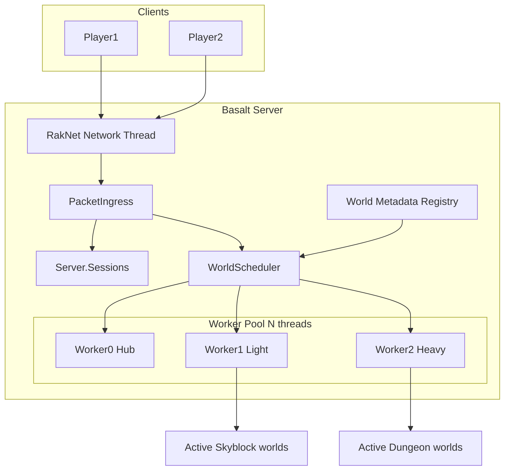
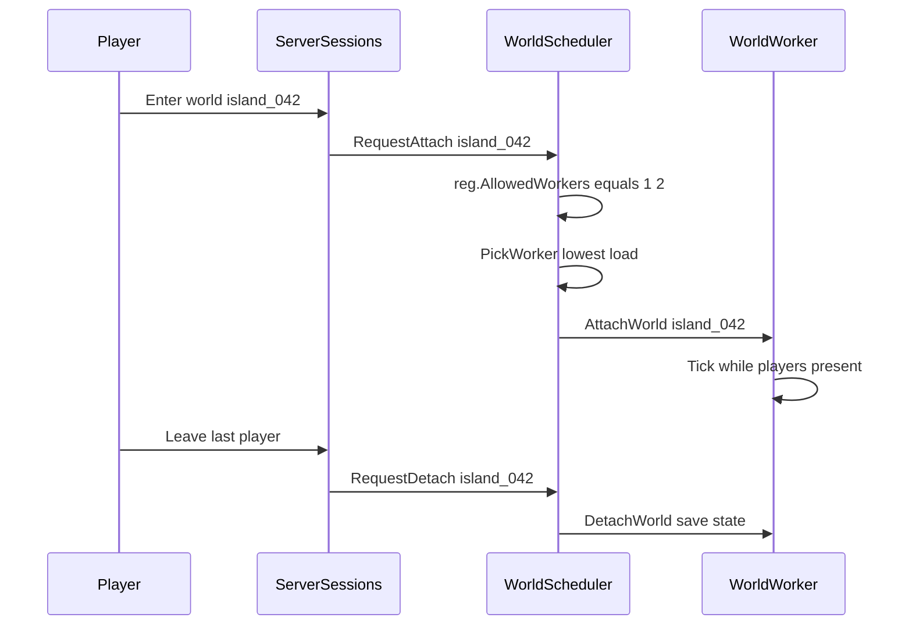

# World Scheduler — Architecture Documentation

Central index for the Basalt **World Scheduler**: a fixed worker pool that runs world simulation on assigned threads, with per-world registration (`allowedWorkers` in `world.json` or API), load-based assignment, and dynamic attach/detach when players enter or leave.

---

## Vision

Basalt will support servers like Skyblock (many light worlds) and dungeon hubs (few heavy worlds) by:

- Keeping a **server-level session registry** for plugins (`Server.Sessions`)
- Running **only worlds with players present** on worker threads
- Letting each world declare **which workers may host it** (`allowedWorkers`)
- Having the scheduler pick the **least loaded allowed worker** on attach

This is **not** one thread per world.

---

## Target architecture



### Attach flow (summary)



---

## Document index

| Doc | Title | Description |
|-----|-------|-------------|
| [00-overview.md](./00-overview.md) | Overview | Problem, goals, non-goals, glossary, use cases |
| [01-current-state.md](./01-current-state.md) | Current state | Baseline audit of Basalt today |
| [02-core-concepts.md](./02-core-concepts.md) | Core concepts | Invariants, layers, lifecycle |
| [03-world-registration.md](./03-world-registration.md) | World registration | Profile, allowedWorkers, JSON/API |
| [04-world-scheduler.md](./04-world-scheduler.md) | World scheduler | PickWorker, attach/detach, worker loop |
| [05-player-session-split.md](./05-player-session-split.md) | Player session split | Session vs entity, refactor map |
| [06-packet-routing.md](./06-packet-routing.md) | Packet routing | PacketIngress, handler classification |
| [07-cross-worker-transfer.md](./07-cross-worker-transfer.md) | Cross-worker transfer | Teleport protocol across workers |
| [08-phased-implementation.md](./08-phased-implementation.md) | Phased implementation | Phases 0–5 deliverables and PR order |
| [09-testing.md](./09-testing.md) | Testing | Automated, manual, stress per phase |
| [10-config-reference.md](./10-config-reference.md) | Config reference | server.properties + per-world JSON |
| [11-agent-implementation-guide.md](./11-agent-implementation-guide.md) | Agent guide | Rules, PR template, checklists |

---

## Reading order (humans and AI agents)

1. [00-overview.md](./00-overview.md)
2. [01-current-state.md](./01-current-state.md)
3. [02-core-concepts.md](./02-core-concepts.md)
4. [08-phased-implementation.md](./08-phased-implementation.md) — identify current phase
5. Phase-specific docs (see table below)
6. [09-testing.md](./09-testing.md) — before marking phase complete
7. [11-agent-implementation-guide.md](./11-agent-implementation-guide.md) — while coding

---

## Implementation order (phases)

| Phase | Focus | Key docs |
|-------|-------|----------|
| **0** | Stubs, WorldRegistration types | [03](./03-world-registration.md), [08](./08-phased-implementation.md) |
| **1** | Main-thread marshaling, active-only tick | [06](./06-packet-routing.md), [09](./09-testing.md) |
| **2** | PlayerSession split | [05](./05-player-session-split.md) |
| **3** | Worker pool, PickWorker, attach/detach | [04](./04-world-scheduler.md), [10](./10-config-reference.md) |
| **4** | Cross-worker transfer | [07](./07-cross-worker-transfer.md) |
| **5** | Metrics, plugins, debug | [11](./11-agent-implementation-guide.md) |

**Do not skip phases.** Phase 3 requires Phase 1 and Phase 2.

---

## Definition of Done (global)

- [ ] `dotnet build` Debug and Release
- [ ] Applicable tests in [09-testing.md](./09-testing.md) pass
- [ ] Manual smoke test: join, move, break block, chat, disconnect
- [ ] Feature flags default to safe legacy behavior
- [ ] Invariants in [02-core-concepts.md](./02-core-concepts.md) preserved

---

## Key source files (current codebase)

| Area | Path |
|------|------|
| Server tick | [`Basalt/Server.cs`](../../../Basalt/Server.cs) |
| World model | [`Basalt/World/World.cs`](../../../Basalt/World/World.cs) |
| Dimension / chunks | [`Basalt/World/Dimension/Dimension.cs`](../../../Basalt/World/Dimension/Dimension.cs) |
| Player | [`Basalt/Player/Player.cs`](../../../Basalt/Player/Player.cs) |
| Network | [`Basalt/Network/Network.cs`](../../../Basalt/Network/Network.cs) |
| Handlers | [`Basalt/Network/Handlers/`](../../../Basalt/Network/Handlers/) |
| Config | [`Basalt/Properties.cs`](../../../Basalt/Properties.cs) |
| Teleport | [`Basalt/Commands/List/Operator/Teleport.cs`](../../../Basalt/Commands/List/Operator/Teleport.cs) |

### Planned new code

```
Basalt/Scheduling/     # Scheduler, workers, messages, PacketIngress
Basalt/Player/PlayerSession.cs
tests/Basalt.Tests/    # Phase 1+
```

---

## Configuration quick reference

```properties
world-thread-count=6
world-scheduler-enabled=false
world-scheduler-debug=false
```

Per-world: see [10-config-reference.md](./10-config-reference.md).

---

## Related discussions

This design addresses:

- Server-level player/session registry (plugin-friendly)
- Entity bound to active world on a worker (transfer-friendly)
- Skyblock: many worlds, only active ones on workers, per-world `allowedWorkers: [1, 2]`
- Dungeons: per-world `allowedWorkers: [2, 5]`, fewer worlds, higher tick cost

See [00-overview.md](./00-overview.md) for non-goals (not per-world player list, not one thread per world).
