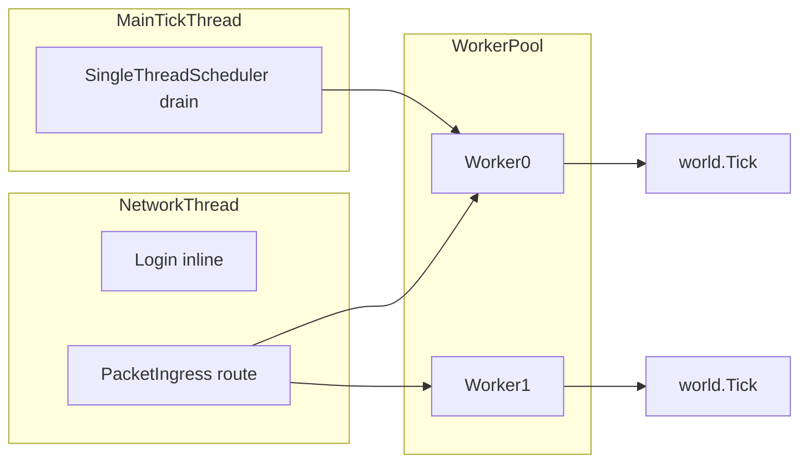

# Implementation Notes — World Scheduler

Notes for reviewers and maintainers. For quick smoke tests, see [quick-test-checklist.md](./quick-test-checklist.md).

[Versão em português](../pt-br/implementation-notes.md)

---

## Phases (0–5) — all complete

| Phase | Focus | Status |
|-------|-------|--------|
| 0 | Stubs, `WorldRegistration`, `world.json` loader | Done |
| 1 | Tick-thread marshaling, active-world-only tick | Done |
| 2 | `PlayerSession` vs entity, `Server.Sessions` | Done |
| 3 | `WorldWorkerPool`, PickWorker, attach/detach | Done |
| 4 | Cross-worker transfer, `/tp world_copy`, snapshot | Done |
| 5 | Metrics, `/worldscheduler`, `RunOnWorldThread`, `Emit` affinity | Done |

Per-phase detail: [../../architecture/world-scheduler/08-phased-implementation.md](../../architecture/world-scheduler/08-phased-implementation.md).

---

## Changes vs original Basalt

### Session vs entity

- **`Server.Sessions`**: thread-safe connection registry (identity, network).
- **`session.ActiveEntity`**: `Player` entity on the current worker; changes on cross-world transfer.
- **`Server.Players` removed** — plugins must use `Sessions` + `ActiveEntity`.

### Scheduler

- **`PacketIngress`**: `Login` inline on network thread; game packets enqueued to the world's worker.
- **`RequestAttach` / `RequestDetach`**: first/last player in a world.
- **`PickWorker`**: lowest load among `allowedWorkers` from `world.json`.

### Cross-world transfer

- Partial snapshot + save on source; respawn on destination.
- `--carry inventory|position` flags on `/tp`.
- Default state: **destination world** save (inventory isolated per world).

See [../../architecture/world-scheduler/07-cross-worker-transfer.md](../../architecture/world-scheduler/07-cross-worker-transfer.md).

### Plugins (Phase 5)

- **`server.RunOnWorldThread(world, action)`** — safe world mutation from another thread.
- **`Server.Emit`**: `ServerStart` and `PlayerJoin` inline (global); other events world-bound on owning worker.
- Do not cache `Player` in static fields; resolve via session each use.

---

## Thread affinity



Full invariants: [../../architecture/world-scheduler/02-core-concepts.md](../../architecture/world-scheduler/02-core-concepts.md).

---

## Key files

| Area | Path |
|------|------|
| Server tick / Emit | `Basalt/Server.cs` |
| Scheduler | `Basalt/Scheduling/WorldScheduler.cs` |
| Workers | `Basalt/Scheduling/WorldWorker.cs` |
| Packet routing | `Basalt/Scheduling/PacketIngress.cs` |
| Transfer | `Basalt/Scheduling/CrossWorldTransferHandler.cs` |
| Per-world player | `Basalt/Player/PlayerWorldTransfer.cs` |
| Teleport | `Basalt/Commands/List/Operator/Teleport.cs` |
| Debug metrics | `Basalt/Commands/List/Operator/WorldSchedulerDebug.cs` |
| Event affinity | `Basalt/Scheduling/SignalAffinity.cs` |
| Config | `Basalt/Properties.cs`, `server.properties` |
| Tests | `tests/Basalt.Tests/` |

---

## Configuration

Properties: [../../architecture/world-scheduler/10-config-reference.md](../../architecture/world-scheduler/10-config-reference.md).

Per-world JSON (`worlds/{id}/world.json`):

```json
{
  "identifier": "world_copy",
  "allowedWorkers": [0, 1]
}
```

---

## Architecture documentation (deep reference)

| Topic | Doc |
|-------|-----|
| Overview | [00-overview.md](../../architecture/world-scheduler/00-overview.md) |
| Current state | [01-current-state.md](../../architecture/world-scheduler/01-current-state.md) |
| Session split | [05-player-session-split.md](../../architecture/world-scheduler/05-player-session-split.md) |
| Packet routing | [06-packet-routing.md](../../architecture/world-scheduler/06-packet-routing.md) |
| Automated tests | [09-testing.md](../../architecture/world-scheduler/09-testing.md) |
| Agent guide | [11-agent-implementation-guide.md](../../architecture/world-scheduler/11-agent-implementation-guide.md) |
