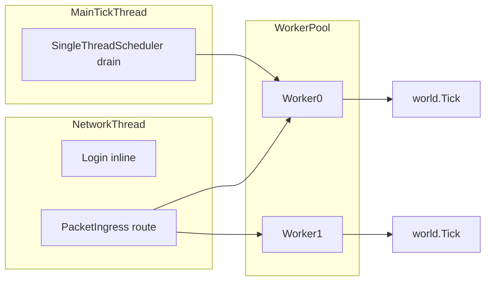

# Implementation Notes — World Scheduler

Notas de implementação para reviewers e mantenedores. Para smoke tests rápidos, use [quick-test-checklist.md](./quick-test-checklist.md).

---

## Fases (0–5) — todas concluídas

| Phase | Foco | Status |
|-------|------|--------|
| 0 | Stubs, `WorldRegistration`, loader `world.json` | Done |
| 1 | Marshaling na tick thread, tick só de mundos ativos | Done |
| 2 | `PlayerSession` vs entidade, `Server.Sessions` | Done |
| 3 | `WorldWorkerPool`, PickWorker, attach/detach | Done |
| 4 | Transfer cross-worker, `/tp world_copy`, snapshot | Done |
| 5 | Métricas, `/worldscheduler`, `RunOnWorldThread`, `Emit` affinity | Done |

Detalhe por fase: [../architecture/world-scheduler/08-phased-implementation.md](../architecture/world-scheduler/08-phased-implementation.md).

---

## Mudanças vs Basalt original

### Sessão vs entidade

- **`Server.Sessions`**: registro thread-safe de conexões (identidade, rede).
- **`session.ActiveEntity`**: entidade `Player` no worker atual; muda em transfer cross-world.
- **`Server.Players` removido** — plugins devem usar `Sessions` + `ActiveEntity`.

### Scheduler

- **`PacketIngress`**: `Login` inline na rede; pacotes de jogo enfileirados no worker do mundo.
- **`RequestAttach` / `RequestDetach`**: primeiro/último jogador no mundo.
- **`PickWorker`**: menor carga entre `allowedWorkers` do `world.json`.

### Transfer cross-world

- Snapshot parcial + save na origem; respawn no destino.
- Flags `--carry inventory|position` no `/tp`.
- Estado default: save do **mundo destino** (inventário isolado por world).

Ver [../architecture/world-scheduler/07-cross-worker-transfer.md](../architecture/world-scheduler/07-cross-worker-transfer.md).

### Plugins (Phase 5)

- **`server.RunOnWorldThread(world, action)`** — mutação segura de mundo a partir de outra thread.
- **`Server.Emit`**: `ServerStart` e `PlayerJoin` inline (global); demais eventos world-bound no worker dono.
- Não cachear `Player` em campos estáticos; resolver via sessão a cada uso.

---

## Thread affinity



Invariants completos: [../architecture/world-scheduler/02-core-concepts.md](../architecture/world-scheduler/02-core-concepts.md).

---

## Arquivos-chave

| Área | Caminho |
|------|---------|
| Server tick / Emit | `Basalt/Server.cs` |
| Scheduler | `Basalt/Scheduling/WorldScheduler.cs` |
| Workers | `Basalt/Scheduling/WorldWorker.cs` |
| Packet routing | `Basalt/Scheduling/PacketIngress.cs` |
| Transfer | `Basalt/Scheduling/CrossWorldTransferHandler.cs` |
| Per-world player | `Basalt/Player/PlayerWorldTransfer.cs` |
| Teleport | `Basalt/Commands/List/Operator/Teleport.cs` |
| Debug metrics | `Basalt/Commands/List/Operator/WorldSchedulerDebug.cs` |
| Event affinity | `Basalt/Scheduling/SignalAffinity.cs` |
| Config | `Basalt/Properties.cs`, `server.properties` |
| Testes | `tests/Basalt.Tests/` |

---

## Configuração

Propriedades: [../architecture/world-scheduler/10-config-reference.md](../architecture/world-scheduler/10-config-reference.md).

Per-world JSON (`worlds/{id}/world.json`):

```json
{
  "identifier": "world_copy",
  "allowedWorkers": [0, 1]
}
```

---

## Documentação de arquitetura (referência profunda)

| Tópico | Doc |
|--------|-----|
| Visão geral | [00-overview.md](../architecture/world-scheduler/00-overview.md) |
| Estado atual | [01-current-state.md](../architecture/world-scheduler/01-current-state.md) |
| Session split | [05-player-session-split.md](../architecture/world-scheduler/05-player-session-split.md) |
| Packet routing | [06-packet-routing.md](../architecture/world-scheduler/06-packet-routing.md) |
| Testes automatizados | [09-testing.md](../architecture/world-scheduler/09-testing.md) |
| Agent guide | [11-agent-implementation-guide.md](../architecture/world-scheduler/11-agent-implementation-guide.md) |
